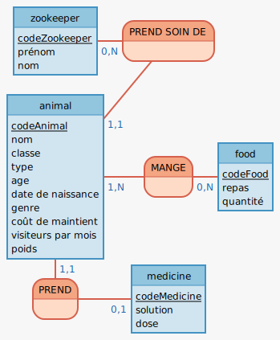
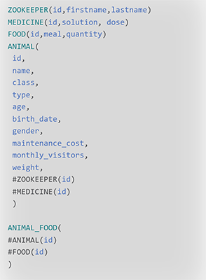

# Recueil de données

| Nom | Description | Type | Commentaire | Entité |
|-----|-------------|-------|------------|--------|
firstname | Prénom du gardien | texte court | - | Zookeeper |
lastname | Nom du gardien | texte court | - | Zookeeper |
solution | Nom du médicament | texte court | - | Medicine |
dose | Dosage du médicament |  nombre | exprimé en mg | Medicine |
meal | Type de repas | texte court | - | Food |
quantity | Quantité du repas |  nombre | exprimé en mg | Food |
name | Nom de l'animal | texte court | - | Animal |
class | Famille à laquelle appartient l'animal   | texte court | - | Animal |
type | Espèce de l'animal | texte court | - | Animal |
age | Age de l'animal | nombre | - | Animal |
birth_date | Date de naisannce de l'animal | nombre | - | Animal |
gender | Mâle ou femelle | booléen | vrai pour mâle | Animal |
maintenance_cost | Coût de maintient | nombre | exprimé en euros par an| Animal |
monthly_visitors | Nombre de visitieur pour l' animal par mois | booléen | exprimé en euros par mois | Animal |
weight | Poid de l'animal | booléen | - | Animal |

# Modèle de Conception des Données

# Modèle Logique des Données 

# Dictionnaire de données

1. Table Zookeeper

| Champ | Type | Spécificités | Description |
|-------|-----|---------------|-------------|
 id | INTEGER | PRIMARY KEY GENERATED ALWAYS AS IDENTIT | identité du gardien |
firstname | VARCHAR(100) | NOT NULL | prénom du gardien |
lastname | VARCHAR(100) | NOT NULL | nom du gardien |
created_at | TIMESTAMPTZ | NOT NULL DEFAULT NOW() | date de création |
updated_at | TIMESTAMPTZ | - | date de modification |

2. Table Medicine 

| Champ | Type | Spécificités | Description |
|-------|-----|---------------|-------------|
 id | INTEGER | PRIMARY KEY GENERATED ALWAYS AS IDENTIT | identité du médicament |
solution | VARCHAR(255) | NOT NULL | nom du médicament  |
dose | INTEGER | NOT NULL DEFAULT 0 | nom du médicament en mg |
created_at | TIMESTAMPTZ | NOT NULL DEFAULT NOW() | date de création |
updated_at | TIMESTAMPTZ | - | date de modification |

3. Table Food 

| Champ | Type | Spécificités | Description |
|-------|-----|---------------|-------------|
 id | INTEGER | PRIMARY KEY GENERATED ALWAYS AS IDENTIT | identité de l'aliment |
meal | VARCHAR(100) | NOT NULL | type de repas  |
quantity | INTEGER | NOT NULL DEFAULT 0 | quantité du repas en mg |
created_at | TIMESTAMPTZ | NOT NULL DEFAULT NOW() | date de création |
updated_at | TIMESTAMPTZ | - | date de modification |

4. Table Animal 

| Champ | Type | Spécificités | Description |
|-------|-----|---------------|-------------|
 id | INTEGER | PRIMARY KEY GENERATED ALWAYS AS IDENTIT | identité de l'animal |
meal | VARCHAR(50) | NOT NULL | nom de l'animal  |
class | VARCHAR(100) | NOT NULL | famille de l'animal  |
type | VARCHAR(50) | NOT NULL | espèce de l'animal  |
age | INTEGER | - | age de l'animal |
birth_date | DATE | - | date de naissance de l'animal |
gender | BOOLEAN | - | mâle ou femelle |
maintenance_cost | INTEGER | - | coût de maintient pour l' animal par an en euros|
monthly_visitors | INTEGER | - | nombre de visitieur pour l'animal par mois |
weight | INTEGER | - | poids de l'animal |
zookeeper_id | INTEGER | NOT NULL | identifiant du gardien|
medicine_id | INTEGER | NOT NULL UNIQUE  | identifiant du médicament |

5. Table d'association Animal_Food

| Champ | Type | Spécificités | Description |
|-------|-----|---------------|-------------|
animal_id | INTEGER | NOT NULL | identifiant de l'animal |
food_id | INTEGER | NOT NULL | identifiant de  l'aliment |
created_at | TIMESTAMPTZ | NOT NULL DEFAULT NOW() | date de création |
